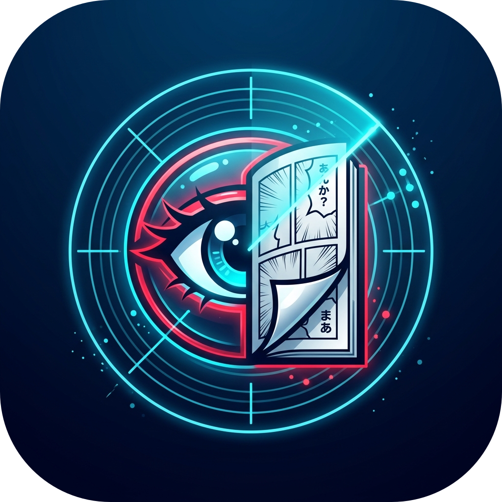

<p align="center">
  
</p>

<h1 align="center">Check Anime & Scans</h1>

<p align="center">
  <strong>Extension Google Chrome moderne pour tracker et vérifier automatiquement les sorties d'animes et de scans.</strong>
</p>

<p align="center">
  
  
  
</p>

<p align="center">
  
</p>

---

## ✨ Fonctionnalités clés

- ⚡ **Scraping Parallèle Haute Performance** : Vérification ultra-rapide par lots concurrents avec timeout `AbortController`.
- 📁 **Dossiers de Favoris Ciblés Dynamiques** : Scanne automatiquement vos favoris Chrome (`ANIMES`, `SCANS`, ou tout dossier personnalisé ajouté via les options).
- 🕒 **Indication du Temps Relatif** : Repérez immédiatement la fraîcheur des sorties (*« Il y a 15 min »*, *« Hier »*).
- 🎯 **Organisation duale Anime / Scan** : Affichage séparé et structuré dans la popup pour distinguer vos séries vidéo et vos lectures de manga / webtoon.
- 🔔 **Notifications & Badges dynamiques** : Badge numérique sur l'icône et alertes Chrome personnalisables.
- ⚙️ **Page d'Options Complète** : Réglage de la fréquence de scan (1h, 2h, 4h, 8h, 12h), gestion des dossiers ciblés et export/import de sauvegarde JSON.
- 🎨 **Interface Dark Mode soignée** : Thème sombre inspiré de l'univers cyber/anime avec affichage des jaquettes (*covers*).
- 👁️ **Gestion des lectures** : Marquage rapide comme lu / non lu individuel ou groupé, sans fermer la popup lors de l'ouverture des liens.

---

## 🚀 Installation (Mode Développeur)

1. **Cloner le dépôt** :
   ```bash
   git clone git@github.com:Lionization/Check-Anime-Scan.git
   ```
2. Ouvrez Google Chrome et accédez à : `chrome://extensions/`
3. Activez le **Mode développeur** (interrupteur en haut à droite).
4. Cliquez sur **Charger l'extension non empaquetée** (*Load unpacked*).
5. Sélectionnez le dossier du projet `check-anime-scan`.

---

## 📁 Architecture du Projet

```text
check-anime-scan/
├── assets/          # Visuels HD (logo transparent, bannière promo)
├── background/      # Adaptateurs de scraping et service worker
├── background.js    # Service Worker (Manifest V3)
├── content/         # Scripts de contenu injectés
├── icons/           # Déclinaisons d'icônes (16px, 48px, 128px, 500px)
├── offscreen/       # Document offscreen pour le parsing DOM
├── options/         # Page des paramètres & options utilisateur
├── popup/           # Interface utilisateur popup (HTML5 / CSS3 / JS)
├── utils.js         # Module central de fonctions partagées
├── test-adapters.mjs# Suite de tests automatisés (npm test)
└── manifest.json    # Déclaration de l'extension Chrome MV3
```
