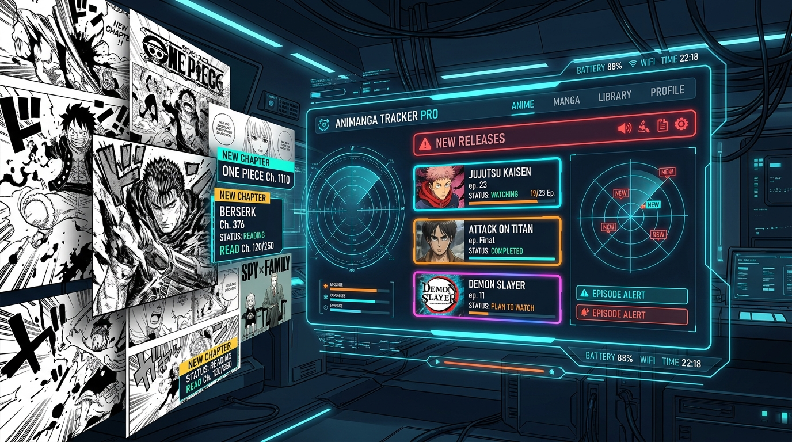

# 🔍 Check Anime & Scans



> Extension Chrome pour vérifier et suivre automatiquement les nouveaux épisodes d'animes et chapitres de scans/mangas depuis vos favoris.

---

## ✨ Fonctionnalités

- ⚡ **Détection automatique** : Vérifie en arrière-plan la sortie de nouveaux épisodes et chapitres.
- 🎯 **Dualité Animes & Scans** : Organisation claire et séparée des sorties (colonnes Animes et Scans).
- 🔔 **Notifications & Badges** : Badge de compteur sur l'icône de l'extension et alertes visuelles.
- 🎨 **Interface Moderne & Sombre** : Design épuré, navigation fluide et ergonomique avec couverture des œuvres.
- 👁️ **Gestion des statuts** : Marquer comme lu / non lu individuellement ou en lot.

---

## 🚀 Installation (Mode Développeur)

1. Clonez ce dépôt sur votre machine :
   ```bash
   git clone git@github.com:Lionization/Check-Anime-Scan.git
   ```
2. Ouvrez Google Chrome et rendez-vous sur `chrome://extensions/`.
3. Activez le **Mode développeur** (en haut à droite).
4. Cliquez sur **Charger l'extension non empaquetée** (*Load unpacked*).
5. Sélectionnez le dossier du projet `check-anime-scan`.

---

## 🛠️ Architecture

- `manifest.json` : Configuration Manifest V3 de l'extension Chrome.
- `background/` & `background.js` : Service worker de synchronisation et alarmes.
- `content/` : Scripts de contenu pour interagir avec les sites sources.
- `popup/` : Interface utilisateur (HTML5, CSS3, Vanilla JS).
- `offscreen/` : Document offscreen pour le parsing DOM en arrière-plan.
- `icons/` : Icônes transparentes de l'extension (16px, 48px, 128px, 500px).
- `assets/` : Ressources graphiques haute résolution.
